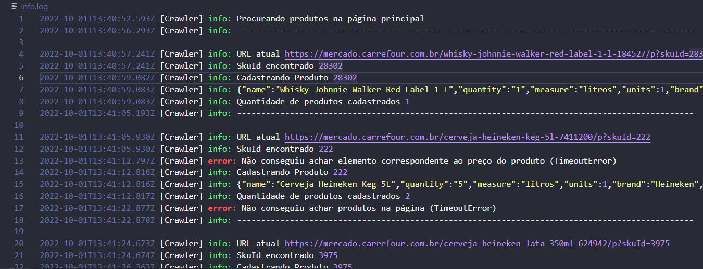

# Carrefour-Crawler
Crawler para busca de produtos da área de mercado do Carrefour

1. Instale as dependências usando
```
npm i ou npm install
```
2. Especifique em .env a quantidade máxima de produtos a ser buscada pela variável PRODUCTS_MAX
3. Especifique em .env a região a ser escolhida no site do Carrefour pela variável PROVINCY
4. Se quiser, especifique em .env a partir de qual página quer que o crawler comece a busca pela variável SEARCH_FROM, caso contrário, ele vai começar da página inicial mercado.carrefour.com.br
4. Rode o aplicativo usando
```
npm start
```
5. Os arquivos info.log e products.json serão criados contendo os logs do aplicativo e a lista de produtos respectivamente

## info.log


## products.json

